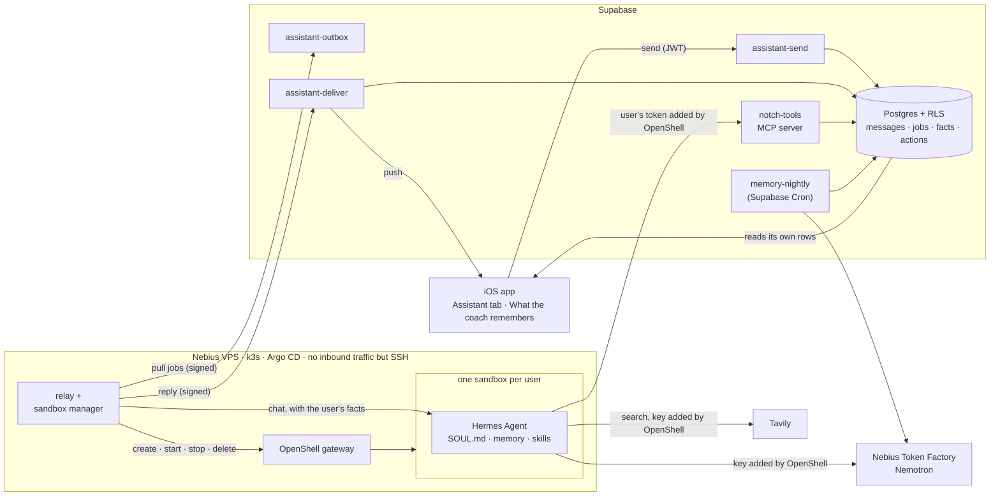

# Notch — a personal strength coach that remembers you and acts for you

Notch is an iOS app with an AI coach that runs a lifter through their workout
set by set, logs every rep and plans progressive overload. It has been on the
App Store since before the hackathon.

For the **Nebius × NVIDIA Global AI Hackathon (Personal AI track)** we added
the **Coach assistant**: an always-on personal coach you can talk to between
workouts. It remembers what matters about you across sessions, looks things
up on the web with sources, changes your training plan when you ask — and lets
you undo it — and checks in every morning on its own. Every user gets their
own agent: **Hermes Agent running in their own NVIDIA OpenShell sandbox**,
thinking with **NVIDIA Nemotron on Nebius Token Factory**.

- **Demo build:** public TestFlight link — *added with the build (by 2026-10-16)*
- **Demo video:** *link added at submission*
- **Judge accounts:** in the Devpost testing instructions (never in this public repository)

> **Status on 2026-09-30.** Everything on the Supabase side, the relay, the
> sandbox manager, the memory pipeline, the Hermes coach profile, the cluster
> manifests and the app screens is written and tested in CI. What's left needs
> the Nebius VPS: bringing the cluster up, building the Hermes sandbox image
> and running the whole path end to end. This README is updated as those land;
> [the plan](docs/nebius-hackathon-plan.md) tracks every item.

## What the Coach assistant does

| | |
|---|---|
| **Talks with you between workouts** | A new *Assistant* tab in the app, separate from the in-workout coach. Replies arrive in the chat and as a push notification. |
| **Remembers you** | A nightly job distils short, typed facts from your chats and workouts — injuries, goals, schedule, equipment, preferences. *What the coach remembers* lists them; delete any and the coach stops using it. |
| **Acts on your behalf** | Saves notes for your next workout and changes an exercise's sets, rep range, rest, intensity or warm-up — never the movement itself. Every change is recorded, stated exactly, and undoable for 24 hours. |
| **Looks things up** | Web search through Tavily for nutrition facts, substitutions and equipment, with sources you can tap. The coach's rules keep personal details out of every query. |
| **Checks in** | A daily morning message about today's workout and one thing it remembers — or nothing, when there's nothing useful to say. |
| **Stays private** | Your agent runs in its own sandbox; its memory, skills and sessions are yours alone. It never holds an API key, and it reaches your training data only through tools that check every read and write against the database. |

## How Nemotron and Token Factory are used

Both model calls go to **Nebius Token Factory** (`https://api.tokenfactory.nebius.com/v1`,
OpenAI-compatible), and both use **NVIDIA Nemotron**:

| Where | Model | Why this one | How it's called |
|---|---|---|---|
| Every Coach assistant reply and daily check-in | Nemotron **Super** (`TOKEN_FACTORY_MODEL`) | Interactive: a person is waiting, and the turn calls tools, so it needs reliable tool calling at low latency and cost | By Hermes, inside the user's sandbox, through its `nebius-token-factory` provider. The key never enters the sandbox: OpenShell's proxy adds it to the request, and only for Token Factory's host. Thinking is off (`reasoning_effort: none`): on a tool-calling turn a reasoning model can spend its whole budget thinking and answer with nothing |
| The nightly memory job | Nemotron **Ultra** (`MEMORY_MODEL`) | A batch job nobody waits for: quality over latency, and thinking on | From a Supabase Edge Function (`memory-nightly`) with a JSON-schema response; every operation it proposes is validated, and the facts' scores are computed in code, not by the model |

Spend is bounded by construction: `_shared/assistant.ts` prices every call
from the usage Token Factory reports (a conservative fallback when it
doesn't), and at a daily ceiling — $1 for prod, $0.50 for dev, $0.50 for the
nightly memory job — the assistant says the day's limit is reached and
nothing more is sent. Hermes' own background model calls (post-turn reviews, session
titles), whose tokens no one could count, are switched off.

Two things stay on Google Gemini through OpenRouter, as before the hackathon:
parsing a training plan from a PDF or photo (Nemotron is text-only) and the
in-workout coach real users have today, which we didn't change during the
hackathon.

## Architecture



- **The app** sends a message to `assistant-send`, which checks the feature
  flag, the subscription, rate limits and the daily caps, stores the message
  and queues a job. Replies land in the user's own rows, which the app reads
  under row-level security.
- **The relay** on the VPS pulls jobs from `assistant-outbox`: the VPS accepts
  no inbound connections, and every request is HMAC-signed per environment.
  For each job it takes the user's sandbox from the **sandbox manager**, sends
  the conversation plus the user's facts — marked as information, never as
  instructions — to that sandbox's Hermes, and posts the reply to
  `assistant-deliver`. A retried delivery is never stored or pushed twice.
- **The sandbox manager** creates a user's sandbox on their first message,
  starts it when a message arrives, stops it after 10 idle minutes and deletes
  it once the account is gone. At most 4 sandboxes run at once in prod
  (2 in dev); a user who doesn't fit waits in the queue, in order, and is
  never served from someone else's sandbox.
- **Hermes** in each sandbox reads the coach's character and rules from
  `SOUL.md` and has exactly four toolsets: the Notch tools, web search, its own
  memory and skills. Terminal, files, code execution and the browser are off.
- **`notch-tools`** is our MCP server: four read tools (profile, plans,
  history with progression computed in code, facts) and three write tools
  (`save_note`, `adjust_plan_exercise`, `undo_last_change`). A tool never takes
  a user id from its arguments; the per-user token decides whose data it is.
- **Memory** has two layers. Canonical is Notch's list of up to 15 typed facts
  per user, scored in code and shown to the user. Hermes' own memory keeps
  coaching know-how only; its user-profile store is off, so a fact the user
  deletes can't live on inside the agent.
- **The cluster** is one k3s node that Argo CD keeps in sync with
  [`deploy/`](deploy/README.md) on `main`. CI builds the images after green
  tests and commits their tags; Argo CD pulls them. A prod sync window freezes
  the demo during judging.

## What we built, and what we build on

OpenShell, Hermes Agent and NemoClaw's Hermes blueprint are the runtime; the
product is the software around them. None of the upstream source is vendored
in this repository: each piece is pulled at a pinned version, under its own
license.

| Ours (MIT, this repository) | Where |
|---|---|
| The MCP tool server over real training data, with the audit trail and undo | `supabase/functions/notch-tools`, migrations `20260928*` |
| The chat channel: queue with leases, deferral and per-user ordering, signed relay endpoints, idempotent delivery | `supabase/functions/assistant-*`, `_shared/relay-auth.ts` |
| The relay and the per-user sandbox manager | `services/relay` |
| The memory pipeline: extraction with per-operation validation, scoring and eviction in code, nightly job, evaluation set | `_shared/memory-*.ts`, `supabase/functions/memory-nightly`, `supabase/eval/memory` |
| The coach's character and rules, the tool allowlist | `deploy/images/hermes-sandbox/profile` |
| Spend ceilings, the kill switch, operations runbooks | `_shared/assistant.ts`, `docs/assistant-ops.md`, `docs/budget-runbook.md` |
| GitOps: bootstrap, Argo CD app of apps, NetworkPolicies, image pipeline | `deploy/`, `.github/workflows/images.yml` |
| The Assistant and memory screens | `apps/mobile/app/(tabs)/coach.tsx`, `apps/mobile/app/coach-memory.tsx` |
| Numbers computed in code, never by the model: the history tool's progression summary, and the in-workout targets (pre-existing) | `notch-tools/read-tools.ts`, `services/agent/src/progression.ts` |

| Upstream | License | How it's used |
|---|---|---|
| [NVIDIA OpenShell](https://github.com/NVIDIA/OpenShell) | Apache-2.0 | Gateway Helm chart 0.1.2 and the `openshell` CLI (shipped in the relay image with its LICENSE and THIRD-PARTY-NOTICES) |
| [Hermes Agent](https://github.com/NousResearch/hermes-agent) (Nous Research) | MIT | The agent in every sandbox |
| [NVIDIA NemoClaw](https://github.com/NVIDIA/NemoClaw) | Apache-2.0 | Its Hermes blueprint is the base of the sandbox image |
| [Agent Sandbox](https://github.com/kubernetes-sigs/agent-sandbox) | Apache-2.0 | The Sandbox CRD and controller OpenShell runs on, v1.0.4 |
| [k3s](https://github.com/k3s-io/k3s), [Argo CD](https://github.com/argoproj/argo-cd) | Apache-2.0 | The cluster and its GitOps sync |

## Repository layout

| Path | What |
|---|---|
| `apps/mobile` | Expo (React Native) iOS app |
| `apps/web` | Next.js landing and legal pages |
| `services/agent` | The in-workout coach service (Fly.io, Gemini) — unchanged for real users |
| `services/relay` | The relay and the sandbox manager (Node, runs on the cluster) |
| `supabase/migrations` | Postgres schema and RLS; hackathon migrations are additive only |
| `supabase/functions` | Edge Functions (Deno); `_shared` holds the shared modules |
| `supabase/cron` | Cron schedules, applied by hand after the functions are deployed |
| `supabase/eval/memory` | Golden set and runner for the memory evaluation |
| `deploy` | The cluster: bootstrap, Argo CD apps, manifests, the Hermes sandbox profile |
| `packages/shared` | Design tokens and domain types |
| `docs` | The hackathon plan, brief and runbooks |

## Engineering rules

- Clients never call a model directly: the in-workout coach goes through the
  agent service, the Coach assistant through the queue and the relay. Usage
  caps, prompt assembly and the kill switches live on the server.
- All client database access is row-scoped by RLS; writes go through Edge
  Functions. The assistant writes only through `notch-tools`, which validates
  every change against the database and records it.
- Numbers the user sees — targets, progress — come from code, never from
  model prose.
- An active workout keeps working offline; sets queue on the device and sync.
- Replies are single complete messages in the user's language.
- During the hackathon, real users keep today's app: new features sit behind
  per-account flags, and migrations are additive only.

## Setup

Requirements: Node 22, pnpm 9.15.9, Deno 2, the Supabase CLI; EAS for app
builds; a Linux host (Ubuntu 24.04) for the cluster.

```bash
pnpm install
pnpm typecheck
pnpm test
```

### Supabase

```bash
supabase link --project-ref <project-ref>
supabase db push
supabase secrets set --env-file supabase/functions/.env
supabase functions deploy assistant-send assistant-outbox assistant-deliver notch-tools memory-nightly
```

`notch-tools`, `assistant-outbox`, `assistant-deliver` and `memory-nightly`
are called without a user JWT (the sandbox's token, the relay's signature, the
cron secret), so `verify_jwt` is off for them in `supabase/config.toml`. Then
apply `supabase/cron/assistant.sql` in the SQL editor for the nightly memory
job and the daily check-in. Turn the assistant on per account with the
`assistant_chat`, `assistant_memory` and `assistant_checkin` flags;
[`docs/assistant-ops.md`](docs/assistant-ops.md) has the queries, the kill
switch and the daily checks.

Secrets (`supabase/functions/.env`, from `.env.example`):

| Variable | What |
|---|---|
| `ASSISTANT_RELAY_SECRET_PROD`, `ASSISTANT_RELAY_SECRET_DEV` | HMAC secrets the relay signs with, one per environment (≥ 32 characters) |
| `ASSISTANT_SPEND_CEILING_CENTS_PROD` / `_DEV` / `_MEMORY` | Daily Token Factory ceilings (defaults 100 / 50 / 50) |
| `ASSISTANT_DAILY_MESSAGES_PER_USER`, `ASSISTANT_DAILY_MESSAGES_GLOBAL` | Daily message caps (100 / 1000) |
| `ASSISTANT_ALLOWED_ORIGINS` | Browser origins for the assistant endpoints; empty for the app |
| `MEMORY_TOKEN_FACTORY_API_KEY`, `MEMORY_MODEL` | The nightly job's Token Factory key and Nemotron model id |
| `MEMORY_CRON_SECRET` | Shared with the cron job through Vault (≥ 32 characters) |
| `AGENT_URL`, `AGENT_SHARED_SECRET` | The in-workout coach service |
| `REVENUECAT_WEBHOOK_SECRET`, `SUBSCRIPTION_PAUSED`, `USAGE_MONTHLY_BUDGET_CENTS` | Subscriptions and the per-user cost breaker |
| `DEV_TEST_LOGIN_EMAILS` | Accounts that sign in without a code (QA, review, demo); random addresses only |
| `SENTRY_DSN`, `SENTRY_ENVIRONMENT` | Error reporting, optional |

### Mobile app

`apps/mobile/.env` from `.env.example`: `EXPO_PUBLIC_SUPABASE_URL`,
`EXPO_PUBLIC_SUPABASE_ANON_KEY`, `EXPO_PUBLIC_REVENUECAT_API_KEY_IOS`,
`EXPO_PUBLIC_SUBSCRIPTION_PAUSED`, and optionally `EXPO_PUBLIC_SENTRY_DSN`,
`EXPO_PUBLIC_POSTHOG_KEY`, `EXPO_PUBLIC_POSTHOG_HOST` and (dev builds only)
`EXPO_PUBLIC_DEV_TEST_ACCOUNTS`.

```bash
pnpm --filter @gymcoach/mobile start
```

### In-workout coach service and website

`services/agent` on Fly.io: `OPENROUTER_API_KEY`, `AGENT_SHARED_SECRET`, and
optionally `SENTRY_DSN`, `SENTRY_ENVIRONMENT`, `AGENT_DISABLED`. The website
(`apps/web`, Vercel): `NEXT_PUBLIC_SUPABASE_URL`, `NEXT_PUBLIC_SUPABASE_ANON_KEY`.

### The cluster

[`deploy/README.md`](deploy/README.md) is the full runbook. In short, on a
hardened Ubuntu 24.04 host:

```bash
sudo deploy/bootstrap/bootstrap.sh
sudo deploy/bootstrap/secrets.sh prod /etc/notch/prod.env
```

The first installs pinned k3s and Argo CD core and hands everything else to
Argo CD; the second loads one environment's secrets from a root-only file on
the host. The relay reads `RELAY_SECRET`, `SUPABASE_FUNCTIONS_URL`,
`TOKEN_FACTORY_MODEL` and `SANDBOX_KEY_SECRET` from there, and `RELAY_ENV`,
`RELAY_SANDBOXES` and `SANDBOX_SHARED_PROVIDERS` from its manifest; the sandbox
manager's optional settings (capacity, idle time, CPU and memory) are listed in
[`services/relay/src/main.ts`](services/relay/src/main.ts). Each
environment's OpenShell gateway holds the Token Factory and Tavily keys as
providers, and each user's `notch-tools` token as a per-user provider the
relay creates. The Hermes image and its profile are described in
[`deploy/images/hermes-sandbox`](deploy/images/hermes-sandbox/README.md).

## Tests

CI runs on every push: typecheck of every workspace, the unit tests (relay,
mobile, in-workout coach), 182 Deno tests for the Edge Functions and shared
modules, locale checks, `deno check` against a baseline, the image-tag tests
and a secret scan. The memory extraction has a separate evaluation set
(`supabase/eval/memory`) that runs against Token Factory.

## What changed during the submission period (after 2026-08-26)

The app itself was built between 2026-07-26 and 2026-08-20. Everything below
is new since 2026-08-26 — about 30 commits and 14 migrations, all additive:

- **The Coach assistant**, end to end: the chat channel and job queue, the
  relay, per-user OpenShell sandboxes with Hermes and their lifecycle, and the
  Assistant tab in the app.
- **Tools that act**: the `notch-tools` MCP server with read tools, write tools
  limited to one exercise's parameters, an audit trail and 24-hour undo.
- **Memory across sessions**: typed facts, scoring and eviction in code, the
  nightly extraction on Nemotron, an evaluation set, and the screen where users
  see and delete what the coach remembers.
- **The proactive daily check-in.**
- **Nemotron on Nebius Token Factory** for every assistant reply and for memory,
  with hard daily spend ceilings.
- **Tavily web search** with sources in the chat.
- **Deployment**: a single-node k3s cluster on a Nebius VPS managed by Argo CD,
  images built by CI, network isolation between environments.
- **Safety net**: per-account feature flags and a kill switch, so real users
  keep today's app; seeded demo and judge accounts; CI with tests, locale and
  type checks, and a secret scan; an MIT license.

## Glossary

- **NVIDIA OpenShell** — a Linux sandbox runtime for AI agents. It isolates each
  agent with Linux kernel features (Landlock, seccomp, network namespaces),
  holds credentials outside the agent and enforces network policy. It has
  nothing to do with Microsoft PowerShell; only the name is similar.
- **NVIDIA NemoClaw** — NVIDIA's reference stack for running agents in
  OpenShell. We reuse its Hermes blueprint (sandbox image and policy presets),
  not its host installer.
- **Hermes Agent** — the open-source agent by Nous Research that runs inside
  each sandbox.
- **Nebius Token Factory** — Nebius' hosted inference, OpenAI-compatible; where
  Nemotron runs.
- **Nemotron** — NVIDIA's open model family.

## License

[MIT](LICENSE), © The Notch authors. Upstream components keep their own
licenses (see the table above).
